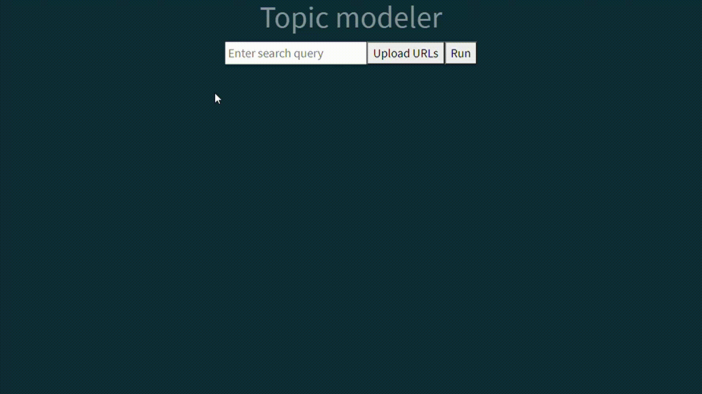
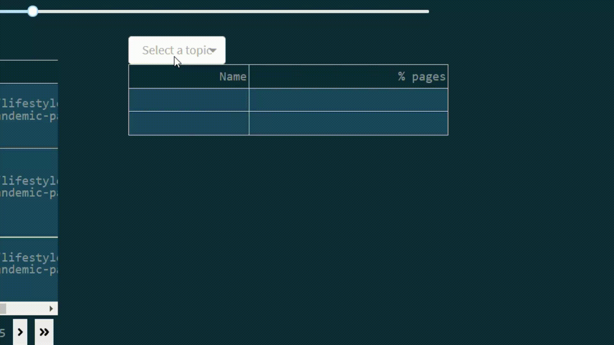

# pulse

A basic topic modeling tool implemented in `Dash`!

The premise is as follows. Suppose you wanted to get a sense of what different communities or organizations are discussing about a topic. Provided a set of domain names (e.g., `nytimes.com`, `foxnews.com`), you can enter keywords related to the topic of interest, upload the set of domain names and press run. The app will query Bing to gather the most relevant pages from each organization on the topic.

After processing the text you're presented with a dashboard of information related to the topics generated. The topic model currently implemented is non-negative matrix factorization with TF-IDF features, but this can easily be swapped for an implementation of latent Dirichlet allocation.

By adjusting the slider you have the ability to generate more/less granular topics, which could affect the saliency of those generated based on the domain being explored and the quality of data extracted.

Below the slider are modules that provide information based on the topics generated.

The bottom left module provides a table containing sentences from pages related to the selected topics. This allows you to preview the type of content in a given topic/set of topics. Additionally, clicking `Export` will download a `csv` version of the entire table.

The bottom right panel displays a table of topic representation per organization. That is, after selecting a topic, a table is given of the organizations in descending order of the percent of their documents associated with the chosen topic.

### Notes on how to run
- The list of domain names should be uploaded as a `csv` with the columns `<domain_name, url>`. The `csv` should be saved in the `data` folder.
- Bing Search requires an API key. This can be obtained for free by creating a Microsoft Azure account. Enter API key on line 10 of `src/search.py` as the value to the key `Ocp-Apim-Subscription-Key`
- To deploy locally, open a terminal, `cd` to the project directory and enter `python app.py`
